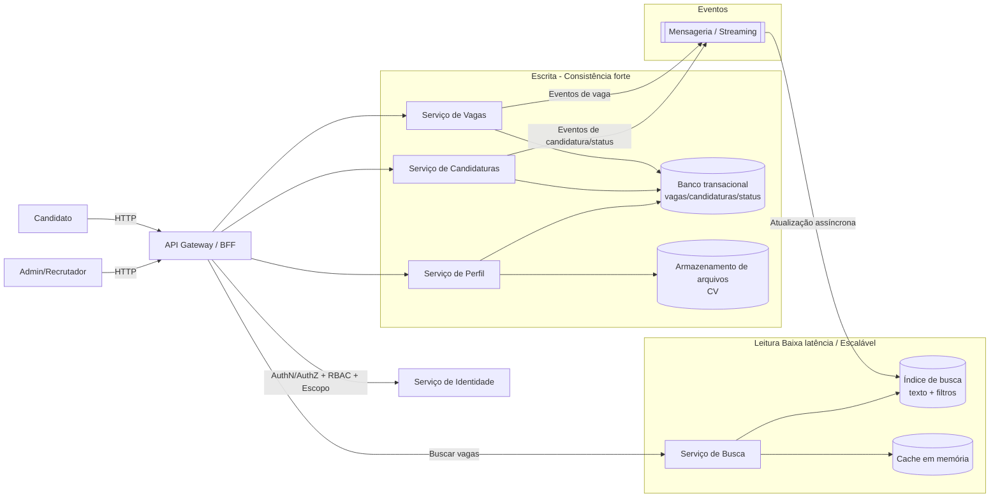

## Título: Sistema de Inscrição e Gestão de Candidaturas para Vagas  

**Nível:** INTERMEDIÁRIO  
**Temas:** busca textual e filtros, RBAC e escopo por gestor, consistência forte vs eventual, CQRS, sharding, idempotência/deduplicação, paginação eficiente, observabilidade

## Resumo do Problema:  

O case descreve uma plataforma onde candidatos autenticados podem buscar vagas por texto e filtros, visualizar detalhes e se inscrever. Em paralelo, usuários com perfil de administrador/recrutador gerenciam vagas sob sua responsabilidade, consultam inscritos, filtram candidatos por critérios (skills, experiência, status) e atualizam o status das candidaturas.

O desafio central é suportar alto volume de buscas com latência baixa e escalabilidade independente do fluxo de escrita, mantendo consistência forte onde o negócio exige (por exemplo, impedir inscrição duplicada e manter status consistente entre candidato e admin), enquanto permite consistência eventual para busca e indexação.

## Requisitos Funcionais  

O sistema deve permitir cadastro e autenticação de usuários, distinguindo papéis de candidato e administrador/recrutador. Administradores devem conseguir criar, editar, ativar/desativar e realizar exclusão lógica de vagas, além de definir requisitos como skills obrigatórias, experiência mínima, localização, modalidade (remoto/híbrido/presencial) e senioridade.

Candidatos devem conseguir buscar vagas por texto (como título e descrição) e por filtros (localização, contrato, senioridade, faixa salarial, skills), com suporte a ordenação (mais recentes e mais relevantes) e paginação eficiente. Um candidato deve conseguir se inscrever em uma vaga, cancelar a inscrição e acompanhar o status da candidatura (aplicado, em análise, rejeitado, aprovado). A plataforma deve registrar a data da inscrição e manter histórico consultável.

Candidatos devem conseguir criar e editar um perfil profissional contendo dados pessoais, skills, experiência e formação, além de realizar upload de currículo. Administradores devem conseguir listar inscritos por vaga, filtrar candidatos por skills/experiência/status, visualizar o perfil completo e alterar o status da candidatura. O sistema deve indicar candidatos que atendem aos requisitos da vaga.

## Requisitos Não Funcionais  

A plataforma deve suportar grande volume de buscas e permitir que a leitura (search) escale de forma independente da escrita. A busca deve responder em menos de 300 ms e continuar funcionando mesmo com falhas parciais, aceitando consistência eventual para resultados indexados. A inscrição em vaga deve ser quase imediata e deve impedir duplicidade com consistência forte.

O sistema deve sustentar disponibilidade mínima de 99,9%, oferecer paginação eficiente (preferencialmente cursor-based quando aplicável) e permitir sharding dos dados de vagas e candidaturas. O status da candidatura deve ser consistente entre visão do candidato e visão do administrador. Observabilidade deve incluir logs estruturados, métricas e rastreamento distribuído.

## Detalhes e Pistas de Implementação  

Uma abordagem natural é separar caminhos de escrita e leitura (CQRS), mantendo a fonte de verdade de candidaturas e status em um armazenamento transacional com garantias fortes e, em paralelo, alimentando um índice de busca/projeções de leitura via mensageria/streaming, aceitando consistência eventual na busca.

Para impedir inscrições duplicadas, é esperado que haja uma garantia determinística no domínio de candidaturas (por exemplo, unicidade por par candidato–vaga em armazenamento transacional, ou uso de chave idempotente/deduplicação). Para escopo de administradores, todas as operações devem aplicar autorização por papel e por ownership (admin só enxerga e modifica vagas que gerencia), incluindo consultas derivadas de projeções.

Paginação e ordenação devem ser projetadas para estabilidade sob alta cardinalidade. Em busca textual, cursores podem ser baseados em chaves estáveis derivadas do ranking/recência. Na listagem de inscritos, cursores baseados em identificadores monotônicos ou timestamp + tie-breaker são preferíveis a offset em cenários de grande volume.

## Mermaid (Componentes e Fluxos)

### Extensões / Perguntas de Reflexão (Opcional)
* Como garantir que exclusão lógica e desativação de vagas não apareçam na busca durante consistência eventual? 
* Como desenhar o modelo de autorização para que o “escopo do admin” seja aplicado também em projeções e caches? 
* Qual a estratégia de sharding mais apropriada (por vaga, por candidato, por gestor, por região) e como isso afeta consultas do admin? 
* Como implementar paginação estável com ordenação por relevância, evitando “saltos” e duplicatas entre páginas? 
* Como balancear custo e performance na camada de busca sem pressionar o banco transacional?