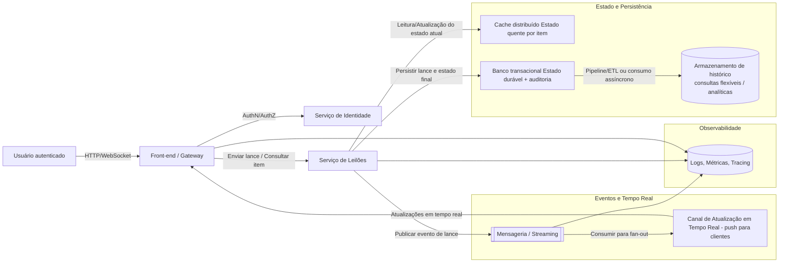

## Título: Sistema de Leilões Online em Tempo Real  
**Nível:** AVANÇADO  
**Temas:** concorrência, consistência de dados, sistemas em tempo real, escalabilidade horizontal, cache, mensageria, ordenação de eventos, observabilidade, resiliência

## Resumo do Problema  

O case descreve o design de uma plataforma de leilões online em tempo real, na qual usuários autenticados podem disputar itens por meio do envio contínuo de lances dentro de uma janela temporal bem definida. O sistema precisa manter o estado atualizado de cada item sob leilão, refletindo mudanças instantaneamente para múltiplos usuários conectados, mesmo em cenários de altíssima concorrência.

Durante leilões disputados, milhares de lances podem ser enviados simultaneamente para um único item, exigindo controle rigoroso de concorrência, ordenação correta dos eventos e consistência entre instâncias distribuídas. Além disso, o sistema deve tolerar falhas, lidar com perda temporária de conectividade e evitar condições de corrida ou empates ambíguos entre lances.

## Requisitos Funcionais  

O sistema deve permitir o cadastro, autenticação e gerenciamento de usuários. Deve possibilitar a criação e administração de itens de leilão, incluindo definição de horários de início e término. Usuários devem conseguir enviar lances, que precisam ser validados quanto ao valor mínimo aceitável e ao período válido do leilão.  

Cada lance válido deve atualizar o estado do item em tempo quase real para todos os participantes conectados. O sistema deve encerrar automaticamente o leilão ao final do prazo, determinar o vencedor, registrar o resultado e manter histórico completo de lances e leilões encerrados. Também deve oferecer mecanismos de consulta e auditoria das atividades de usuários e itens.

## Requisitos Não Funcionais  

O sistema deve operar com baixa latência, garantindo propagação rápida das atualizações de lances. Deve oferecer alta disponibilidade e escalar horizontalmente para suportar picos de tráfego intensos e concentrados.  

É necessário assegurar consistência do estado mesmo com múltiplas réplicas ativas, além de tolerância a falhas para que quedas parciais não interrompam o funcionamento global. O sistema deve ser plenamente observável, com coleta de métricas, logs estruturados e rastreamento distribuído. Requisitos de segurança incluem proteção de dados sensíveis, autenticação robusta e prevenção contra manipulação de requisições pelo cliente.

## Restrições  

O sistema não deve expor informações sensíveis nem permitir que decisões críticas de negócio sejam tomadas no lado do cliente. Deve preservar o modelo atual de persistência de dados e garantir a ordem correta dos eventos, evitando inconsistências entre réplicas distribuídas. Não é permitido assumir processamento estritamente sequencial ou dependência de estado compartilhado sem mecanismos explícitos de coordenação.

## Tecnologias (em formato genérico)  

- Serviço central de aplicação para orquestração dos leilões  
- Camada de cache distribuído para acesso de baixa latência ao estado dos itens  
- Banco de dados transacional para persistência definitiva e auditoria  
- Banco de dados orientado a documentos ou eventos para histórico e consultas flexíveis  
- Sistema de mensageria ou streaming para propagação de eventos em tempo real  
- Infraestrutura de observabilidade (logs, métricas e tracing)  
- Mecanismos de autenticação e controle de acesso  

## Detalhes e Pistas de Implementação  

Espera-se que o candidato discuta estratégias de controle de concorrência para múltiplos lances simultâneos, como serialização por item, uso de locks distribuídos, filas particionadas ou controle otimista de versão. Devem ser considerados mecanismos para ordenação de eventos, idempotência de lances e resolução determinística de empates.  

Também são relevantes discussões sobre separação entre estado quente (em memória/cache) e estado durável, bem como estratégias para sincronização entre instâncias, recuperação após falhas e consistência eventual versus forte. O uso de comunicação orientada a eventos para atualização em tempo real e desacoplamento entre componentes é um ponto central do case.

## Extensões / Perguntas de Reflexão (Opcional)  

Como garantir justiça e determinismo em lances simultâneos com valores idênticos? Qual o impacto de escolher consistência forte versus eventual para o estado do leilão? Como o sistema se comporta sob falhas de rede durante momentos críticos do leilão? Que estratégias podem ser usadas para reduzir contenção em itens extremamente disputados? Como evoluir a arquitetura para suportar leilões globais com múltiplas regiões?

### Mermaid - Guia

