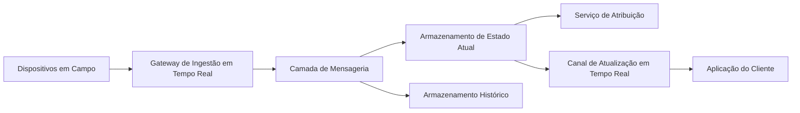

## Título: Plataforma Distribuída de Ingestão de Telemetria e Despacho em Tempo Real

**Nível:** Avançado

**Temas:** Sistemas Distribuídos, Ingestão de Eventos, Geolocalização, Arquiteturas Write-Heavy, Baixa Latência, Consistência Eventual, Escalabilidade

## Resumo do Problema:
Uma plataforma de logística em tempo real conecta agentes móveis a solicitações de clientes finais. Um dos componentes centrais do sistema é responsável por receber continuamente dados de telemetria de localização provenientes de dispositivos móveis em campo. Essas informações alimentam algoritmos de estimativa de chegada e de atribuição dinâmica de tarefas com base em proximidade geográfica.  

Durante períodos de pico, o sistema enfrenta uma carga intensa de escrita, com atualizações frequentes de localização e a necessidade de refletir essas mudanças quase instantaneamente para usuários finais. A solução atual utiliza comunicação síncrona baseada em requisições periódicas e armazenamento relacional, o que tem provocado contenção, aumento de latência e falhas operacionais.  

O desafio consiste em reprojetar essa plataforma para suportar ingestão massiva de dados de localização, consultas geoespaciais eficientes e visualização quase em tempo real, mantendo alta disponibilidade e respeitando requisitos de consistência distintos conforme o tipo de dado.

## Requisitos Funcionais
- Receber atualizações frequentes de coordenadas geográficas de agentes móveis em intervalos curtos.
- Permitir consultas geoespaciais para localizar agentes disponíveis dentro de uma área delimitada.
- Atualizar a visualização da posição do agente para o cliente final com atraso mínimo.
- Registrar o histórico completo de trajetos para fins de auditoria e análise posterior.
- Manter o controle consistente do estado operacional do agente (ex.: disponível ou em atendimento).

## Requisitos Não Funcionais
- Latência de atualização percebida pelo cliente inferior a centenas de milissegundos em percentis elevados.
- Capacidade de escalar para dezenas ou centenas de milhares de agentes ativos simultaneamente.
- Alta disponibilidade para a ingestão de dados de localização, considerada crítica para o funcionamento do sistema.
- Consistência eventual aceitável para dados de visualização, mas consistência forte exigida para estados operacionais.
- Minimização do consumo de bateria e dados móveis nos dispositivos de campo.
- Arquitetura independente de provedor de nuvem.
- Conformidade com legislações de proteção de dados para armazenamento e retenção de histórico de movimentação.

## Diagrama Conceitual (Mermaid)

### Detalhes e Pistas de Implementação
* A arquitetura pode ser orientada a eventos, desacoplando ingestão, processamento e persistência por meio de uma camada de mensageria. 
* O armazenamento do estado mais recente deve ser otimizado para escrita intensiva e consultas geoespaciais de baixa latência, enquanto o histórico pode ser tratado como um fluxo assíncrono para camadas de armazenamento mais econômicas.
* A comunicação entre dispositivos móveis e backend pode utilizar canais persistentes e eficientes para reduzir overhead e consumo energético. 
* A distinção clara entre dados críticos de coordenação (estado do agente) e dados de visualização permite aplicar modelos de consistência diferentes, alinhados ao impacto de negócio.
* A separação entre “hot path” (decisões em tempo real) e “cold path” (auditoria e analytics) é fundamental para manter previsibilidade sob carga elevada. 