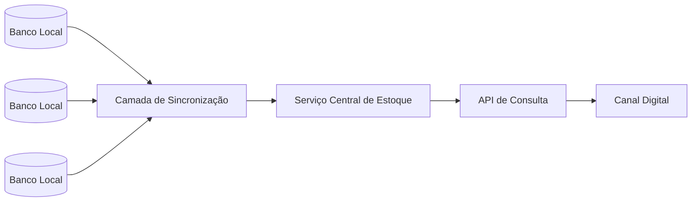

## Título: Sistema Distribuído de Gestão de Estoque para Varejo

**Nível:** Intermediário

**Temas:** Sistemas Distribuídos, Consistência vs Disponibilidade, Sincronização de Dados, Arquitetura Backend, Latência, Experiência do Usuário

## Resumo do Problema:
Uma organização opera um sistema de gestão de estoque para uma rede distribuída de lojas físicas. Cada loja mantém um banco de dados local responsável pelo controle de produtos, preços e quantidades. Esses dados são sincronizados periodicamente com um repositório central, em intervalos fixos.  

Clientes finais consultam o estoque por meio de um canal digital, porém a estratégia atual de sincronização introduz atrasos e inconsistências entre o estado real do estoque nas lojas e o que é exibido online. Essas discrepâncias impactam diretamente a experiência do usuário e resultam em perdas de vendas.  

O sistema existente é baseado em um backend monolítico e uma aplicação web legada no frontend. O desafio consiste em evoluir a arquitetura para reduzir inconsistências, melhorar a visibilidade do estoque e lidar corretamente com atualizações concorrentes em um ambiente distribuído, mantendo a solução simples e amplamente discutível em termos de System Design.

## Requisitos Funcionais
- Permitir que unidades distribuídas atualizem informações de produtos, incluindo preço, quantidade disponível e atributos descritivos.
- Disponibilizar informações de estoque para consumo por canais digitais com menor latência perceptível.
- Sincronizar dados entre unidades locais e um núcleo central de forma confiável.
- Tratar atualizações concorrentes de estoque oriundas de múltiplas unidades.
- Expor uma camada de backend com responsabilidades bem definidas e interfaces claras.

## Requisitos Não Funcionais
- O sistema deve explicitar sua estratégia de consistência, podendo priorizar disponibilidade ou consistência conforme decisões arquiteturais.
- Deve suportar falhas parciais de conectividade entre unidades distribuídas e o núcleo central.
- A arquitetura deve favorecer simplicidade operacional e clareza conceitual.
- A solução deve ser escalável horizontalmente no backend.
- Utilizar preferencialmente tecnologias de código aberto.

## Diagrama Conceitual (Mermaid)

### Detalhes e Pistas de Implementação
* A separação entre leitura e escrita pode ser explorada para reduzir impacto de latência percebida, permitindo que o canal digital consulte uma visão otimizada do estoque. Estratégias de sincronização assíncrona e propagação de eventos podem substituir sincronizações periódicas rígidas, reduzindo janelas de inconsistência.
* Conflitos de atualização podem ser tratados por versionamento, registros de eventos ou políticas claras de precedência. O backend pode ser decomposto em serviços menores, cada um com responsabilidades específicas, como ingestão de atualizações, consolidação de estado e exposição de dados para leitura.
* A escolha entre priorizar consistência ou disponibilidade deve ser explícita e alinhada ao domínio de negócio, considerando tolerância a divergências temporárias de estoque versus impacto direto em vendas e confiança do usuário.

### Extensões / Perguntas de Reflexão (Opcional)
* Em quais cenários a inconsistência temporária de estoque é aceitável para o negócio?
* Como a arquitetura se comporta durante falhas prolongadas de conectividade em uma unidade?
* Quais métricas seriam fundamentais para detectar degradação de sincronização ou aumento de conflitos?
* Como evoluir o sistema para suportar picos sazonais de acesso sem degradar a experiência do usuário?