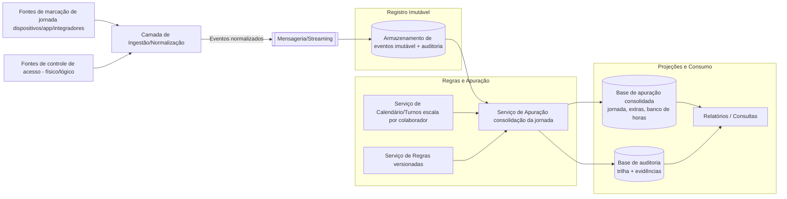

## Título: Sistema Integrado de Gestão de Jornada de Trabalho e Controle de Acesso  
**Nível:** INTERMEDIÁRIO  
**Temas:** conformidade trabalhista, cálculo de jornada, integridade e imutabilidade de dados, auditoria, integração de sistemas, regras de negócio complexas, consistência, segurança

## Resumo do Problema:  

O case descreve a implantação de uma solução integrada para gestão de jornada de trabalho (registro de ponto) e controle de acesso físico/lógico, com necessidade de consolidar registros de múltiplas fontes e aplicar regras de conformidade trabalhista. O sistema deve calcular jornadas com base em escalas e turnos (incluindo operação em três turnos), tratar colaboradores com regimes distintos (campo, remoto e presencial) e considerar regras de compensação como banco de horas, além de políticas de horas extras e exceções.

O objetivo é produzir um “registro consolidado” e confiável da jornada, capaz de suportar auditoria e disputas legais, evitando qualquer possibilidade de alteração indevida dos dados e garantindo rastreabilidade completa do que ocorreu, quando ocorreu, e como o resultado foi calculado.

## Requisitos Funcionais  

O sistema deve capturar eventos de marcação de jornada e eventos de controle de acesso provenientes de diferentes mecanismos (por exemplo, dispositivos de registro, aplicativos móveis, integrações de terceiros), normalizando-os para um formato comum e associando-os a colaboradores e a uma janela de trabalho (turno/escala). Deve consolidar entradas/saídas, intervalos e ocorrências relevantes, compondo a jornada diária de cada colaborador.

A solução deve aplicar regras trabalhistas e políticas internas para determinar horas normais, horas extras, compensações e saldo de banco de horas, considerando regimes distintos (remoto/campo/presencial), turnos e possíveis exceções. Deve gerar relatórios operacionais e de auditoria, permitindo rastrear o conjunto de eventos brutos que originou cada cálculo consolidado, bem como o conjunto de regras vigentes aplicado no momento do processamento.

## Requisitos Não Funcionais  

O sistema deve preservar integridade e confiabilidade dos dados, garantindo rastreabilidade e não-repúdio: uma vez registrado e consolidado, o histórico não pode ser alterado sem evidência, trilha de auditoria e controle estrito. Deve oferecer segurança forte (controle de acesso, segregação de funções, autenticação robusta), além de observabilidade para identificar falhas de integração, inconsistências e atrasos de processamento.

A solução deve tolerar falhas parciais e operar com consistência adequada para evitar divergências em saldos e apurações. Também deve suportar evolução de regras, incluindo mudança de legislação ou políticas internas, preservando a capacidade de reprocessamento e de comparação histórica entre “regra vigente à época” e “regra atual” sem destruir evidências.

## Detalhes e Pistas de Implementação  

Uma modelagem orientada a eventos é natural para garantir trilha de auditoria e reduzir risco de adulteração. Registros brutos (marcações e acessos) podem ser tratados como eventos imutáveis, com assinatura/hashing encadeado para evidenciar qualquer alteração posterior. A consolidação (jornada apurada, saldo de banco de horas, horas extras) pode ser materializada como projeções derivadas, associando explicitamente qual versão de regra foi aplicada e quais eventos foram consumidos.

Para lidar com colaboradores remotos e em campo, é relevante discutir confiabilidade da origem dos dados (dispositivos, geolocalização opcional, janelas permitidas, antifraude) sem depender de “dados frágeis” como única fonte de verdade. Para turnos e escalas, o sistema precisa de uma camada de “calendário de trabalho” (escala/turno por colaborador) que determine como eventos se encaixam na janela correta, incluindo cruzamento de dia e troca de turno.

A governança do reprocessamento é central: mudanças de regra não devem “reescrever” o passado sem trilha. Uma abordagem é manter apurações versionadas por período e por versão de regra, permitindo auditoria e comparativos. Em cenários de integração, filas/streaming podem reduzir acoplamento e permitir retries idempotentes, garantindo ingestão confiável.

## Mermaid (Visão de Componentes e Projeções)

### Extensões / Perguntas de Reflexão (Opcional)
* Como provar integridade e não-repúdio dos registros de marcação sem depender de confiança cega no dispositivo de origem? Como tratar reprocessamento quando regras mudam, sem “apagar” o histórico anterior? 
* Como lidar com eventos fora de ordem, duplicados ou atrasados vindos de múltiplas fontes? 
* Qual o limite entre consistência forte e eventual nesse domínio, e onde ela é obrigatória? 
* Como desenhar segregação de funções e trilhas de auditoria para evitar manipulação interna (fraude operacional)?